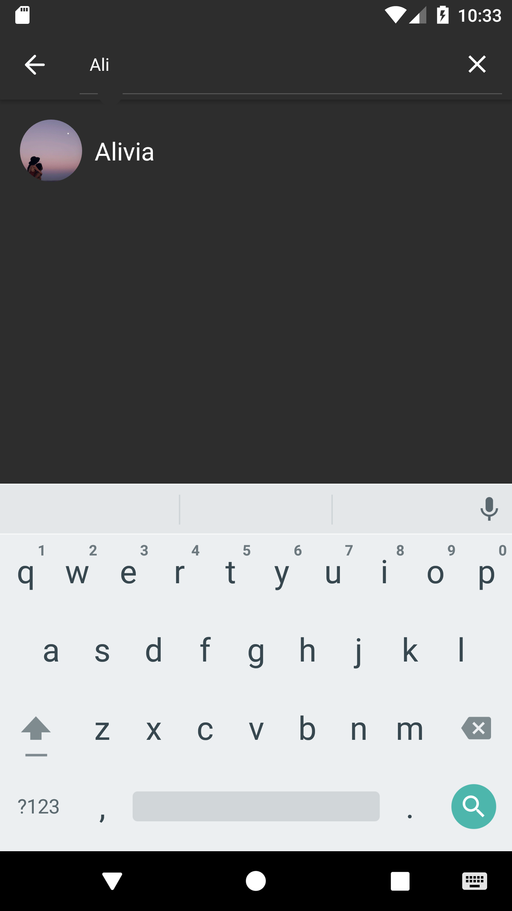

# Sup-Chat

## This project is a pet project and was written solely for educational purposes. In this project i do use : 
### MVP
### Moxy
### Koin
### RxJava
### Retrofit
### Firebase Database
### Multi-module structure 
### Clean Architecture

                              

       

       

